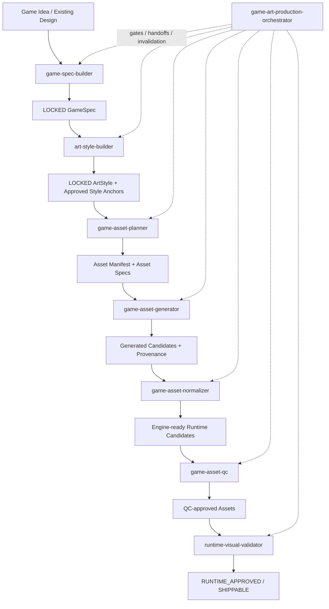
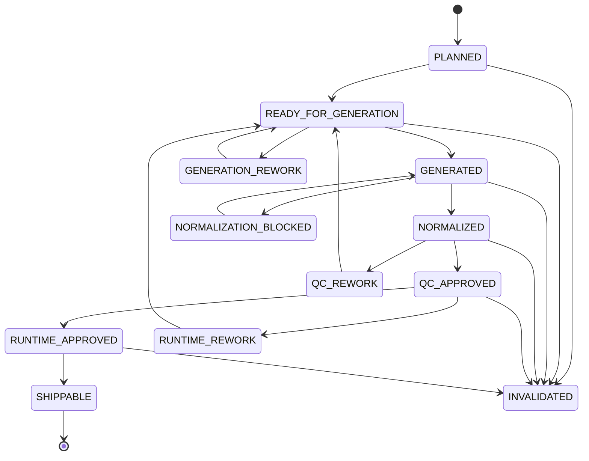

# AI-Native Game Production Skills

Composable agent skills for building a game production pipeline from game specification and art direction through asset generation, QC, and runtime validation.

## Install

### Install all skills

```bash
npx game-production-skills install
```

Skills are installed to:

```text
.agents/skills/
```

### Install selected skills

```bash
npx game-production-skills install game-spec-builder art-style-builder
```

### List available skills

```bash
npx game-production-skills list
```

### Reinstall existing skills

```bash
npx game-production-skills install --force
```

### Agent Skills CLI

The repository can also be installed directly with the Agent Skills CLI:

```bash
npx skills add rolot789/game-production-skills --all
```

Or install one skill:

```bash
npx skills add rolot789/game-production-skills --skill game-spec-builder
```

## Skills

| Skill | Purpose |
|---|---|
| `game-spec-builder` | Builds and locks a structured game specification through adaptive design interviews. |
| `art-style-builder` | Defines and locks art direction, calibration rules, and approved visual anchors. |
| `game-asset-planner` | Converts GameSpec + ArtStyle into semantic asset inventories and production specs. |
| `game-asset-generator` | Compiles asset specs and references into reproducible generation jobs and candidates. |
| `game-asset-normalizer` | Normalizes generated assets for predictable runtime scale, canvas, alpha, anchor, and pivot behavior. |
| `game-asset-qc` | Validates technical quality, style consistency, family consistency, and gameplay readability. |
| `runtime-visual-validator` | Validates approved assets inside real game scenes and detects runtime visual regressions. |
| `game-art-production-orchestrator` | Coordinates the complete pipeline, readiness gates, handoffs, failure routing, and invalidation. |

## Pipeline



## Asset Lifecycle



## License

MIT
